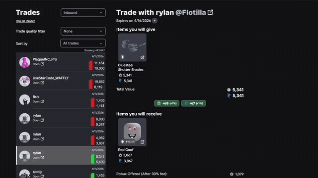
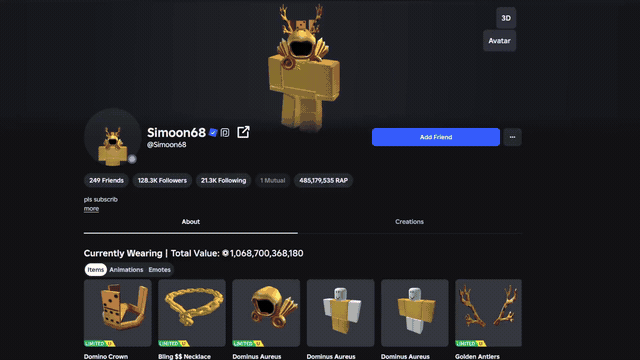
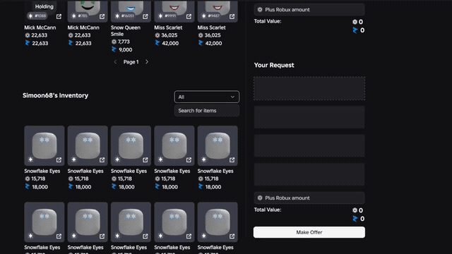

<p align="center">
  
</p>

<h1 align="center">nevos trading extension</h1>

<p align="center">
  Readable source for the Roblox trading browser extension.
</p>

<p align="center">
  <a href="https://nevos-extension.com">Website</a> ·
  <a href="https://www.youtube.com/watch?v=_KB9yUQk95I">YouTube</a> ·
  <a href="https://discord.gg/tHReJPn2q5">Discord</a>
</p>

<p align="center">
  <a href="https://discord.gg/tHReJPn2q5">
    
  </a>
  <a href="https://discord.gg/tHReJPn2q5">
    
  </a>
</p>

Release builds stay minified. This repo keeps the readable source, manifests, and assets.

## What It Is

nevos trading extension is a Roblox trading extension for Chrome, Brave, Edge, Opera, Firefox, and Safari. It adds trading tools directly into Roblox pages so traders can check values, review trades, search trade windows, spot item flags, and move through trade pages faster without bouncing between sites.

## Clone

```powershell
git clone https://github.com/NevoQF/nevos-trading-extension.git
cd nevos-trading-extension
```

## Features ✨

### Values

- Rolimons values on trade windows, trade lists, catalog pages, and user pages.
- Optional Routility USD values.
- Post-tax trade value and Robux tax difference helpers.
- Profile inventory overview with value, RAP, item count, and item flags.
- Sale data button on trade items.
- RAP raise/drop indicators for items sitting over or under nearby value tiers.

### Trading

- Trade win/loss stats.
- Trade analysis tools for deeper trade review.
- Trade window item search.
- Duplicate trade warning.
- Quick decline button.
- Bulk trade actions.
- Mobile trade items button.

### Notifications

- Inbound trade notifications.
- Declined trade notifications.
- Completed trade notifications.

### Items And Profiles

- Rare item flags.
- Projected item flags.
- Item profile links.
- Item ownership history links.
- User profile links.
- User badge display.

### Extra Tools

- Colorblind mode.
- Optional Roblox 2FA autofill with password-protected encrypted storage.
- Option to disable RAP in win/loss stats.
- Direct manual install builds for supported browsers.
- Settings stored locally through browser storage.

## Demos 🎥

<table>
  <tr>
    <td align="center">
      <a href="docs/media/trade-review-tools.mp4">
        
      </a>
      <br>
      Trade review & filters
    </td>
    <td align="center">
      <a href="docs/media/inventory-overview.mp4">
        
      </a>
      <br>
      Inventory values & flags
    </td>
    <td align="center">
      <a href="docs/media/trade-window-search.mp4">
        
      </a>
      <br>
      Trade window search
    </td>
  </tr>
</table>

## YouTube Demo

GitHub README pages do not play YouTube embeds inline. Use the thumbnail link.

[](https://www.youtube.com/watch?v=_KB9yUQk95I)

## Source 🔎

The readable extension source is in `extension/`. Internal release packaging tools are intentionally excluded from this public source repo.

## Layout

```text
extension/            extension source
docs/media/           demo previews and videos
```

## License

Source is shared for review and verification only. Official builds are free for personal use. Reuploading, rebranding, reselling, or claiming authorship is not allowed. See `LICENSE`.

## Star ⭐

If this source helps you verify the extension or you like the project, a star on the repo helps.
